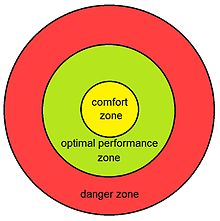

+++
title = "Binary Search As A Tool For Getting Out Of Your Comfort Zone"
tags = ["lifestyle"]
categories = ["Thoughts"]
draft = true
+++

# Binary Search Overview {#binary-search-overview}

Binary search is an algorithm for finding an element in a list.

It may be best illustrated by an example.

Suppose you have a 10000 page book, each page labeled with its page number. How do you go about finding page 9879?

One way would be to look at each page one at a time and check whether or not it is page 3408. This would require looking at every page, imagine how long that would take!

How can we do this faster? One idea would be to look only at every other page. We would only have to look at half as many pages! The problem with this approach is that you may skip right past your page and not find it at all...

Instead, lets binary search!r Start at the middle, go right if too small, go left if too big, and you'll be at your page in no time!

# Applying Binary Search To Your Comfort Zone {#applying-binary-search-to-your-comfort-zone}

Binary search is more applicable to life than you may suspect. It applies not only to finding the perfect amount of time to microwave something, or the turning to the right page number in a book, but also to optimizing your comfort zone.

## Comfort Zones {#comfort-zones}

Why do comfort zones exist? What makes things outside of the comfort zone scary? It is the unknown risk to reward.

Therefore, the best way I can define a comfort zone would be a state of mind where a person’s anxiety and vulnerability are minimized to manageable levels. It is that area of your life in which you feel familiar with and in control of.

<https://addicted2success.com/life/here-is-everything-you-need-to-know-about-your-comfort-zone/>

Actions in your comfort zone are those for which you have a good understanding of the risk to reward ratio, and that you are happy with it. Often times the risk if very low.
It is true that without leaving our comfort zones, we might never know what we are capable of and what we can do.

In general people are risk averse.



Comfort zone is tied to levels of anxiety associated with actions. Where does anxiety come from? Risk-reward?

It applies to any sort of thing that you are trying to optimize.

For example, identifying actions that offer the optimal level of risk. Take actions with too low of a risk, and you are missing out on actions with higher risk. Take actions with too high of a risk, and you will face the consequences.

This leads us to an important note on binary search: it requires knowledge of lower and upper bounds. Taking the example of the book. We can only know which page is the middle of the book, if we know how many pages are in the book. It may seem like the lower and upper bound will always be obvious, but this is not the case.

Take the example of action risk. It is common for people to stick to low cost actions, and to increment the risk a tiny step at a time. This is the naive algorithm which is forced upon you by not knowing the upper bound! If you knew the upper bound, you could hop around instead of taking tiny steps to make sure you don't overcommit.

So you want to find an upper bound, how do you do that? You need to try an action that you think to be too risky. There are two possible outcomes:

1.  The action was too risky and you face some consequences. Congratulations you now have an upper bound and can perform binary search.
2.  The action was not too risky. Congratulations, you just disovered that an action you previously thought to be too high risk is not so. You can now reap the rewards of such actions without facing consequences.

It's a win-win situation!

So now I leave you with the task of finding an action to get you into trouble.

# How I Applied This To My Own Life {#how-i-applied-this-to-my-own-life}

I was going sledding with some friends, but we didn't have enough sleds. I see a couple sleds leaning against a tree with nobody nearby. To me they look like someone is trying to share the love of sledding with others!

Some would deem the action of taking these sleds as too high risk. Me, I decided that while the action may be too high risk, I couldn't be sure. In any case the worst penalty would be returning the sleds to their proper owners.

So I hop on over and grab the sleds. We are having a good time. About 20 minutes go by, and a woman walks up and asks us if we got the sleds from against the tree. We say yes, are they yours? She replies that yes, they are hers, but that we can keep sledding on them. Just put them back when you are done please. Yes maam! Look at that. I discovered that an action I may have previously perceived as too risky, to be within the bounds of attractive actions. I can now push the bounds at a much quicker rate than if I had been in the mindset of making as incremental steps as possible.

Facing penalties does not equal too high risk. You decide what is too high risk based on the risk to reward ratio.

# Conclusion {#conclusion}

This is a very valuable technique that I hope you find of use in your own life. It's funny to see its ties to the computer science binary search algorithm!

Sometimes getting into a little trouble is for the best. "Ask forgiveness, not permission". Don't take this too much to the extreme though.
This is a tool for helping you get out of your comfort zone? People like to take incremental steps out of their comfort zone, but this is slow. Much faster would be to break out of your comfort zone with the goal of going too far. This goal can help your mindset to get you out there. And you can justify it with the binary search algorithm.

# Other One Line Examples {#other-one-line-examples}

Basically anything that takes you out of your comfort zone:

-   breaking someones heart
-   assertiveness
-   dancing
-   talking to strangers

Always happy to hear how you use this in your life. Shoot me an email!
